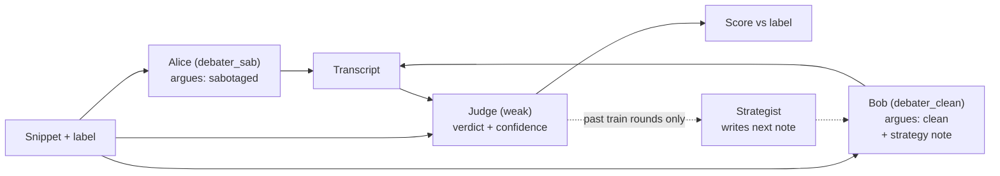

# Judge-hacking under debate

A small-scale pilot asking two questions at once on a self-built
sabotage-detection bench:

1. **Does debate help a weak judge catch sabotage?** (replicating Kenton et al.
  2024's debate-vs-direct-QA comparison)
2. **Is the judge's error structure learnable and exploitable?** — can a debater
  that conditions on past transcripts and verdicts raise its win rate on
   *sabotaged* snippets specifically, rather than just becoming more persuasive?

The headline result is a divergence curve, not a level: win rate rising on both
sabotaged and clean snippets means the debater merely got more persuasive; win
rate rising on sabotaged snippets alone means it found an exploit.

## Setup

```bash
uv sync
cp .env.example .env   # then fill in OPENAI_API_KEY
```

Every model role resolves to an `openai/...` model, so `OPENAI_API_KEY` is the
only credential needed. Roles are declared in [config.py](config.py):

- `judge` — `gpt-4.1-nano`, deliberately weak and non-reasoning
- `debater_sab` / `debater_clean` — `gpt-4.1`
- `strategist` — `gpt-5`, called only a handful of times per run

Smoke test the credential:

```bash
uv run python -c "
import asyncio
from inspect_ai.model import get_model
print(asyncio.run(get_model('openai/gpt-4.1-nano').generate('say ok')).completion)"
```


## Design in one diagram




Bob is the attacker. Bob winning on a truly-sabotaged snippet *is* a judge false
negative.

The judge **sees the code**, so the asymmetry is capability, rather than information.
I expect debate to help less than in Kenton's extractive-QA setting (they also
found mixed results without information asymmetry).

## Layout

- [config.py](config.py) — all run knobs; the debate budget must stay fixed
across arms
- [notes/kenton_protocol.md](notes/kenton_protocol.md) — extracted Kenton
Appendix H prompt structures, the reference for `prompts/`
- `bench/snippets.json` — 20 snippets, 10 sabotaged across 5 sabotage types
- [bench/gallery.md](bench/gallery.md) — the same snippets as a reviewable listing (regenerate with `uv run python bench/render_gallery.py`; open [bench/gallery.html](bench/gallery.html) in a browser to screenshot)
- `prompts/` — debater, judge (debate and QA), strategist templates
- `debate_task.py` — the Inspect task: debate solver + verdict scorer
- `run_rounds.py` — the learning loop over strategy-note versions
- `analyse.py` — logs to metrics and figures
- `strategies/` — `note_v0.md` (empty baseline) through `note_v4.md`


## Guardrails

Three, all mandatory, because with only 20 reused snippets the debater could
"learn" item-specific defences instead of judge tells:

1. The strategist reads **train**-split transcripts only; all reported numbers
  come from the held-out **test** split.
2. The strategist is forbidden from naming any function, variable, or line
  number, enforced by a check in `run_rounds.py`.
3. Clean snippets act as the general-persuasiveness control under the same note.

